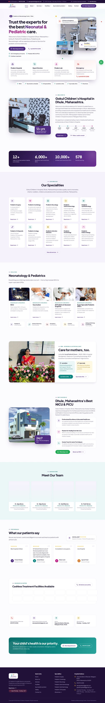

# Gokul Children's Hospital — website redesign

A redesign of [gokulchildhospital.com](https://gokulchildhospital.com/). It keeps all of the original content and adds a new UI and UX.
It's a plain static site: HTML, one CSS file and one small JS file. There's no framework and no build step at runtime.



## What's new

- **Easier access everywhere:** a sticky header with *Book Appointment*, a 24/7 emergency number in the top bar, a floating WhatsApp button, and on phones a fixed bottom bar with **Call · WhatsApp · Directions · Book**.
- **Online appointment requests:** the booking form (a dialog on every page, plus the Contact page) collects the parent's name, mobile number, child's name and age, department, date and consultation type (in-person / video / audio). It then opens WhatsApp with the message already filled in, or sends it by email. No server needed.
- **Clear information architecture:** 10 speciality pages, 4 facility pages, separate Ayurveda and Lactation clinic pages, About (with Mission and Vision), Gallery and Contact. Each detail page has a sidebar for quick switching and a "Let's help you" contact card.
- **Readable content:** condition lists are shown as scannable chips, and the vaccination schedule is an age-by-age timeline. Dr. Deore's training is a visual timeline, and the stats count up as you scroll.
- **Gallery** with a keyboard- and swipe-friendly lightbox. The Facilities page can be filtered.
- **Accessibility and SEO:** semantic HTML, skip link, visible focus styles, 44px+ tap targets, reduced-motion support, meta and Open Graph tags, and `Hospital` schema.org data.
- **Fast:** images re-encoded to WebP (13 MB → 3 MB), lazy-loaded, and only one web font (Plus Jakarta Sans).

Brand colours (purple / teal / magenta) are sampled from the Gokul logo.

## Structure

```
index.html, about.html, services.html, <speciality>.html, facilities.html,
nicu.html, vaccination.html, …, ayurveda.html, lactation.html, gallery.html, contact.html
assets/css/style.css   design system + components
assets/js/main.js      menu, booking → WhatsApp, lightbox, filters, counters
assets/img/            optimised images from the original site
_src/content.py        ALL text content (edit here)
_src/build.py          renders every page from content.py
```

## Editing content

1. Change the text in `_src/content.py`. Phone, email, address and hours are in `SITE` at the top.
2. Run `python3 _src/build.py` (Python 3.9+, no dependencies).
3. The HTML pages in this folder are regenerated.

## Hosting

Upload the folder to any static host: the existing web host, Netlify, Vercel or GitHub Pages. `_src/` is only needed for editing and doesn't have to be uploaded.

## Content to confirm with the hospital

These items are copied as-is from the current site, but they look like template placeholders:

- **Meet Our Team:** Dr. Ajay Nema, Dr. Vijay Kumar, Dr. Sunil Sharma and Dr. Punit Verma all have identical credentials and stock photos.
- **"578 Awards Winning"** in the stats band.
- The NICU and Vaccination pages on the old site list "Dr. Khan" three times. This card was left out.

The following were dropped because they were empty or template leftovers: the Blog page (it has no posts), the social icons (they link nowhere), and the Contact page text "Do you want to reach the next level of business success?".
